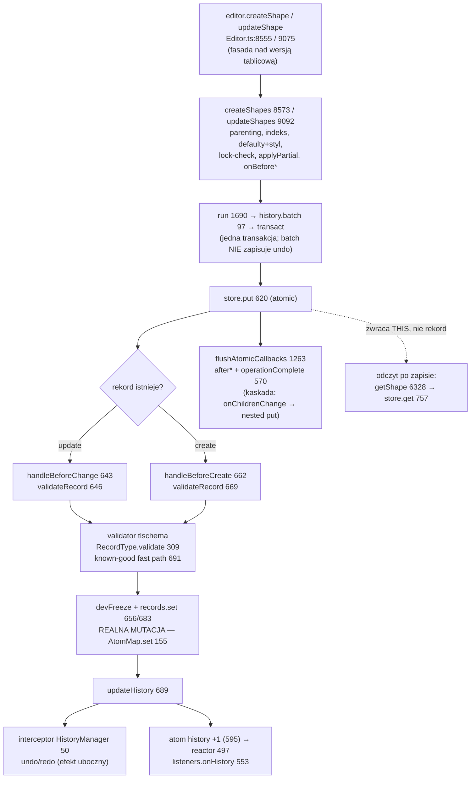

# Research: przepływ zapisu kształtu w tldraw

## Cel (Deep Focus — Krok 0)

**Co badam:** ścieżkę zapisu kształtu (shape) — od publicznego API edytora (`editor.createShape` / `updateShape`), przez warstwy, do trwałej mutacji stanu i z powrotem.
**Od którego pliku:** `packages/editor/src/lib/editor/Editor.ts` (entry point) → `packages/store/src/lib/Store.ts` (`put`) → walidatory w `packages/tlschema`.
**Czemu mapa wskazała ten obszar:** to strefa ryzyka nr 1 z Mapy projektu — `editor` jako hub silnika (50 cykli plikowych) sprzężony z warstwą `store` (najtwardszy coupling w repo) i kontraktem `tlschema`. Zapis kształtu to biznesowy rdzeń SDK: każda zmiana na tablicy przechodzi tędy.

## Metoda i rygor

Trzej równolegli agenci, każdy na innym wymiarze: **(1) trace end-to-end**, **(2) luki w testach**, **(3) blast radius** (graf zależności + co-change z gita). Mapa z L2 posłużyła jako *prior* (hipoteza do potwierdzenia w kodzie), nie jako prawda. Każde twierdzenie oznaczone: **[evidence]** = potwierdzone w kodzie z `plik:linia`, **[inference]** = wywnioskowane, **[unknown]** = biała plama. Twierdzenia liczbowe/strukturalne („tylko tutaj", liczby wystąpień) czekają na twardą weryfikację `ast-grep` w Kroku 3.

---

## ② Feature overview — jak naprawdę działa zapis kształtu

To przepływ, nie spis plików. Najkrótsze streszczenie: **to, co wygląda jak gruby stos warstw, jest w większości fasadami — realna praca dzieje się w trzech miejscach: `createShapes`/`_updateShapes` (przygotowanie), `Store.put` (mutacja + walidacja + efekty), i validator `tlschema` (kontrakt).**

### Ścieżka w skrócie (sekwencja, z dowodami)

1. **Entry point to fasada.** `createShape(shape)` tylko woła `createShapes([shape])`; `updateShape` → `updateShapes([...])` — `Editor.ts:8555`, `9075`. Pojedynczy zapis pod spodem jest **wsadowy** (batch). [evidence]
2. **Realna praca przygotowawcza** w `createShapes` (`Editor.ts:8573`): bramki (readonly, pusta tablica, limit `maxShapesPerPage` 8577–8590), ustalenie rodzica i normalizacja współrzędnych (8603–8678), indeks fraktalny (8700), scalenie propsów + `store.schema.types.shape.create(...)` nadające `id`/`typeName`/defaulty (8716–8737), hook `onBeforeCreate` (8743). Analogicznie `_updateShapes` (`Editor.ts:9129`): pomija kształty zablokowane (9104–9116), `applyPartialToRecordWithProps` (9150) — jeśli nic się nie zmieniło, `continue`; hook `onBeforeUpdate` (9156). [evidence]
3. **Transakcja (cienka warstwa).** `run(fn)` (`Editor.ts:1690`) tylko przełącza flagę i woła `history.batch` (`HistoryManager.ts:97`), który owija całość w `transact()` z `@tldraw/state`. Zagnieżdżone `run` scalają się w jedną transakcję. **`batch` sam nie zapisuje historii undo.** [evidence]
4. **Zapis:** `this.store.put(records)` (`Editor.ts:8762` / `9163`). [evidence]
5. **TU naprawdę zmienia się stan** — `Store.put` (`Store.ts:620`, w `atomic()`): dla update `handleBeforeChange` (643) → `validateRecord` (646) → jeśli wynik identyczny referencyjnie, `continue` (653, brak zmiany i brak historii) → `devFreeze` + `records.set(id, record)` (655–656); dla create analogicznie (662–683). Realna komórka stanu to **`AtomMap.set`** (`AtomMap.ts:155`) — atom per rekord (reaktywny). [evidence]
6. **Walidacja** (`tlschema` + `@tldraw/validate`): `StoreSchema.validateRecord` (370–381) i `RecordType.validate` (309–314) to **fasady delegujące**; realną robotę robi validator kształtu `T.model('shape', T.union('type', …createShapeValidator…))` (`TLShape.ts:566`, `TLBaseShape.ts:158`). Na update działa **szybka ścieżka** `validateUsingKnownGoodVersion` (`validation.ts:691`): waliduje tylko klucze zmienione referencyjnie; gdy nic się nie różni, zwraca stary obiekt → `Store.put` pomija zapis. [evidence]
7. **Co wraca:** `createShapes`/`updateShapes` zwracają **`this`** (edytor, fluent) — **nie** zapisany rekord (`Editor.ts:8765`, `9125`). Zapisany obiekt to nie ten z wejścia, lecz zwalidowany i **zamrożony** (`devFreeze`). Dane po zapisie **nie są ponownie czytane z bazy** — żeby dostać rekord, trzeba go świadomie odczytać: `getShape` → `store.get` → `AtomMap.get` (`Editor.ts:6328`, `Store.ts:757`). [evidence]
8. **Historia undo powstaje jako efekt uboczny, nie jako akcja edytora.** `HistoryManager` w konstruktorze rejestruje *interceptor* na store (`HistoryManager.ts:45–65`); przy każdym diffie od `source==='user'` akumuluje `pendingDiff`. Diff idzie przez `updateHistory` → `historyAccumulator.add` (synchronicznie odpala interceptory, `Store.ts:588`) oraz bump reaktywnego atomu `history` (595) → `historyReactor` (throttled do klatki, 497) → zewnętrzne `listeners.onHistory` (553). [evidence]
9. **Efekty końcowe transakcji:** `flushAtomicCallbacks` (`Store.ts:1263`) odpala `after*` i `operationComplete`; edytor w `operationComplete` (`Editor.ts:570–622`) sprząta `PageState`, robi `onChildrenChange` (co **samo woła `updateShapes`** — zagnieżdżony `put` w tej samej transakcji), domyka bindingi i emituje `update`. Granulację jednego „kroku" cofania wyznaczają **marki** (`markHistoryStoppingPoint`), a nie pojedynczy `run`. [evidence / inference]

### Diagram

### Trzy rzeczy, których nie widać z drzewa plików

- **Struktura folderów kłamie:** większość warstw (`createShape` pojedynczy, `run`, `history.batch`, `StoreSchema.validateRecord`, `RecordType.validate`) to przezroczyste fasady. Realna praca jest gęsto skupiona w `createShapes`/`_updateShapes`, `Store.put` i validatorze `tlschema`. [evidence]
- **„Zapisz jeden kształt" to operacja wsadowa** nad mechanizmem zbiorczym, a dane po zapisie **nie wracają z bazy** — to te same obiekty z pamięci, jedynie zwalidowane i zamrożone. [evidence]
- **Undo to nie jawny zapis, tylko przechwycony efekt uboczny** `store.put`. Bez prześledzenia interceptora wyglądałoby to na osobny mechanizm. [evidence]

---

## ③ Technical debt — gdzie boli (mapa kruchości, nie lista brzydkich plików)

Kluczowe rozróżnienie tej sekcji: **część sprzężeń jest tania** (mechaniczna, łapana przez kompilator/CI), a **część droga i cicha** (nic jej nie pilnuje). Mylenie jednego z drugim to klasyczny błąd.

### Dług DROGI i CICHY — rdzeń ryzyka

1. **props (walidator) ↔ migracja, wewnątrz pliku kształtu.** Każdy plik kształtu trzyma *triadę do ręcznej synchronizacji*: walidatory propsów, identyfikatory wersji (`createShapePropsMigrationIds`) i migracje `up`/`down` — np. `TLArrowShape.ts:~249 / ~272 / ~290+`. Nic nie wymusza migracji, gdy zmienisz walidator: `StoreSchema.validateMigrations` (`StoreSchema.ts:326`) sprawdza tylko spójność *sekwencji* wersji (brak luk/duplikatów), nie „zmieniłeś schemat bez migracji". Brak snapshotu schematu (`.snap`), który wymuszałby bump wersji. Walidacja biegnie **przy zapisie**, migracje **przy odczycie** — więc rozjazd ujawnia się dopiero w runtime na realnie zapisanych danych, nie w CI. To *connascence znaczenia na dużym dystansie* — dwie połowy jednego kontraktu bez bariery narzędziowej. [evidence + inference, wysokie zaufanie]
2. **schema/migracje ↔ sync-core (runtime).** Serwer synchronizacji migruje przychodzące zapisy klienta do *swojej* wersji schematu: `TLSyncRoom.ts:133` („client writes are migrated to the server's schema version"), własny `StoreSchema` serwera (`:311`) serializowany (`:381`). Klaster schema co-zmienia się z `TLSyncRoom.ts`/`TLSyncClient.ts`/`TLSocketRoom.ts`/`recordDiff.ts` (po ~3 wspólne commity). Graf importów widzi tylko `sync-core → @tldraw/store`; że zmiana migracji może zepsuć klientów na starej wersji względem serwera — tego kompilator nie łapie. Mapa oznaczyła sync jako `unknown`; tu **uściślam kanał: to wersjonowanie schematu**, nie tylko `@rocicorp/zero`. [evidence + inference]
3. **Kolejność w `Store.put`.** Walidacja przy zapisie i migracja przy odczycie to sprzężenie *kolejności/etapu* — żaden kompilator nie pilnuje, że obie połowy modelu pozostają zgodne. [inference]

### Dług TANI i GŁOŚNY — wygląda groźnie, ale CI/kompilator łapie

- **Warstwa generowana `api-report.api.md`** — co-change **53/87** z `Editor.ts`, ale generowana przez api-extractor i pilnowana w CI (`.github/workflows/checks.yml:63 → yarn api-check`). Zapomnisz zregenerować → CI czerwone. To nie jest realny dług. [evidence]
- **Szew typów** — `TLShape` importowany w **152 plikach**, `TLShapeId` w 131, `TLShapePartial` 36, `TLRecord` 31, `TLBaseShape` 23. Największy zasięg liczbowo, ale zmiana sygnatury = błąd `tsc` (pre-commit `tsc --noEmit` + CI). Głośny, tani. [evidence]

### Luki w testach — gdzie brakuje siatki bezpieczeństwa

Happy-path, limit `maxShapesPerPage` i blokada kształtów są **solidnie pokryte** (`createShapes.test.ts:100–156`, `maxShapes.test.ts`, `lockShapes.test.ts`). Silnik `Store`, side-effecty i migracje też — ale na fiksturach `Book`/`Author` (`Store.test.ts`, `StoreSideEffects.test.ts`) lub tranzytywnie, więc transfer na kształty jest [inference]. Realne dziury są na **ścieżkach błędów kontraktu**:

1. **Walidatory rekordu kształtu w `tlschema` bez własnych testów** (największa luka): `createShapeValidator` (`TLBaseShape.ts:158`), `shapeIdValidator` (115), `parentIdValidator` (97), union po `type` (`TLShape.ts:566`) — brak `TLShape.test.ts`/`TLBaseShape.test.ts`. Front-line walidacji zapisu ma tylko jeden pośredni test edytora. [evidence]
2. **Nieznany/niezarejestrowany typ kształtu na zapisie** — brak testu (ani assert `getShapeUtil` `Editor.ts:1377`, ani odrzucenie union-walidatora). [inference]
3. **Rollback `updateShapes` na poziomie edytora** — `createShapes` ma test atomowości (`createShapes.test.ts:135`), `updateShapes` **nie** ma odpowiednika. [evidence]
4. **Readonly early-return dla `updateShapes`/`deleteShapes`** — brak bezpośredniej asercji (dla `createShapes` jest). [inference]
5. **Kolizja id w `createShapes`** — istniejące id → ciche nadpisanie (upsert), bez strażnika i bez testu; niejasne, czy zamierzone. [evidence]

### Blast radius — pary vs huby

- **Pary ciasno związane (zmieniaj razem, wąsko):** plik kształtu `TL<Shape>.ts` (props+wersje+migracje) ↔ jego `ShapeUtil`; `store-migrations.ts` ↔ `migrate.ts` ↔ `StoreSchema.ts`. [evidence]
- **Huby (jedna zmiana promieniuje szeroko):** `Editor.ts` (hub silnika — `ShapeUtil.ts`, `TldrawEditor.tsx`, `editor/src/index.ts` po ~12–19 wspólnych commitów); `StoreSchema.ts`/`createTLSchema.ts` (hub kontraktu spinający store↔tlschema↔validate↔sync-core). [evidence]
- **Rekomendacja wąska:** dotykając zapisu kształtu, traktuj *plik kształtu (props+wersje+migracje) + `store-migrations.ts`/`StoreSchema.ts` + `sync-core/TLSyncRoom.ts`* jako **jeden nierozłączny zestaw** — tylko tam kompilator i CI Cię nie osłonią. [inference]

---

## Korekty priora (mapa z L2 vs rzeczywistość)

Mapa była dobrym drogowskazem, ale kilka rzeczy research uściślił/skorygował — jawnie, zamiast po cichu przepisać jako fakt:

- **Mapa:** „editor hub + coupling ze store". **Uściślenie:** przepływ potwierdzony, ale realna mutacja stanu to `AtomMap.set` w `Store.put`, a nie „editor zapisuje". Editor w większości *przygotowuje*, a nie *zapisuje*. [evidence]
- **Mapa:** sync jako `unknown` (runtime coupling `@rocicorp/zero`). **Uściślenie:** dla zapisu kształtu istotniejszy kanał to **wersjonowanie schematu** — serwer `tlsync` migruje zapisy klienta do swojej wersji. [evidence]
- **Surowy co-change kłamał:** commity masowe (`#8330 sort imports` 277 plików, `#6722 docs` 263, `#8258 oxlint` 205, `#6982` 203, `#9172` 35) fałszywie spinały wszystkie pliki testowe store. Po odfiltrowaniu realny klaster schema/migracji zszedł do 3–7 wspólnych commitów. [evidence]

## Weryfikacja twierdzeń strukturalnych (ast-grep — Krok 3)

Twardo sprawdzone `ast-grep` 0.45.0 (przez `npx`, bez instalacji w repo) + `grep`. Reguła lekcji: liczy `ast-grep`, każde zero potwierdza `grep` (żeby odróżnić realny brak od złego wzorca).

| Twierdzenie z raportu | Werdykt | Ustalenie |
|---|---|---|
| Zapis kształtu przechodzi przez `store.put` | ✅ potwierdzone / doprecyzowane | `store.put` to uniwersalny kanał zapisu — **23** call-sites w Editor.ts (kamera, pageState, assets, bindings, users…); zapis **kształtów** to dokładnie **2** z nich: `Editor.ts:8762` (create), `9163` (update). Czyli „zawsze przez store.put" — tak, ale store.put jest ogólny, a kształty mają 2 konkretne wejścia. |
| `createShape`/`updateShape` (pojedyncze) to fasady nad mnogimi | ✅ potwierdzone | `createShape → createShapes([shape])` (`8556`), `updateShape → updateShapes([partial])` (`9076`). Doprecyzowanie: `updateShapes` wołane **22×**, `createShapes` **4×** w Editor.ts — wersje mnogie to wewnętrzny kanał wielu metod, nie tylko cel fasad. |
| Kontrakt kształtu = union po polu `type` | ✅ doprecyzowane | **13** konkretnych typów kształtów w `tlschema/src/shapes` (Arrow, Bookmark, Draw, Embed, Frame, Geo, Group, Highlight, Image, Line, Note, Text, Video) + `TLBaseShape` (baza). |
| Walidatory kształtu w `tlschema` BEZ testów (największa luka) | ✅ potwierdzone twardo | **0** plików testowych `TLShape`/`TLBaseShape` w tlschema; **0** wystąpień `createShapeValidator` w `*.test.ts` — zero potwierdzone grepem (realny brak, nie zły wzorzec). |
| Zasięg typów: TLShape 152 / TLShapeId 131 / TLShapePartial 36 / TLRecord 31 / TLBaseShape 23 | ⚠️ doprecyzowane (liczby skorygowane) | Ponowne liczenie (`grep -rlw`, packages+apps): **TLShape 176, TLShapeId 164, TLShapePartial 45, TLRecord 43, TLBaseShape 25**. Kierunek i rząd wielkości potwierdzone (TLShape/TLShapeId najszersze), ale dokładne liczby zależą od metody liczenia — traktować jako przybliżenie, nie precyzję. |

**Wniosek:** sedno raportu (fasadowość, `store.put` jako jedyny kanał zapisu, brak testów walidatorów kształtu) potwierdzone twardo. Skorygowano jedynie dokładne liczby zasięgu typów — praktyczny dowód reguły „im pewniej wygląda liczba, tym bardziej warto ją sprawdzić".

## Ograniczenia i unknowns

- **[unknown] Ścieżka `source==='remote'`** (sync: `tlsync`/`@rocicorp/zero`) wchodzi przez `mergeRemoteChanges`/`applyDiff` z pominięciem interceptora undo — nie prześledzona tutaj; to osobna gałąź poza zapisem z API edytora.
- **[inference] Testy `Store`/side-effects na fiksturach `Book`/`Author`**, nie na `TLShape` — przeniesienie wniosków na kształty jest wywnioskowane, nie udowodnione.
- **Okno co-change ~12 miesięcy** — aktywność ≠ ważność; historia ≠ dziś (weryfikuj istnienie plików przed decyzją).
- **Twierdzenia strukturalne/liczbowe** zostały zweryfikowane `ast-grep` + `grep` — patrz sekcja „Weryfikacja" wyżej. Liczby zasięgu typów skorygowano w górę (kwestia metody liczenia); sedno raportu potwierdzone twardo. **Co-change (53/87)** to metryka historyczna z gita, poza zakresem `ast-grep` — pozostaje jako sygnał, nie twardy fakt strukturalny.

*To Deep Focus na jednym przepływie, nie refaktor. Naturalny następny krok (M4L4): decyzja, co i jak bezpiecznie ruszyć — oparta na sekcji Technical debt powyżej.*
