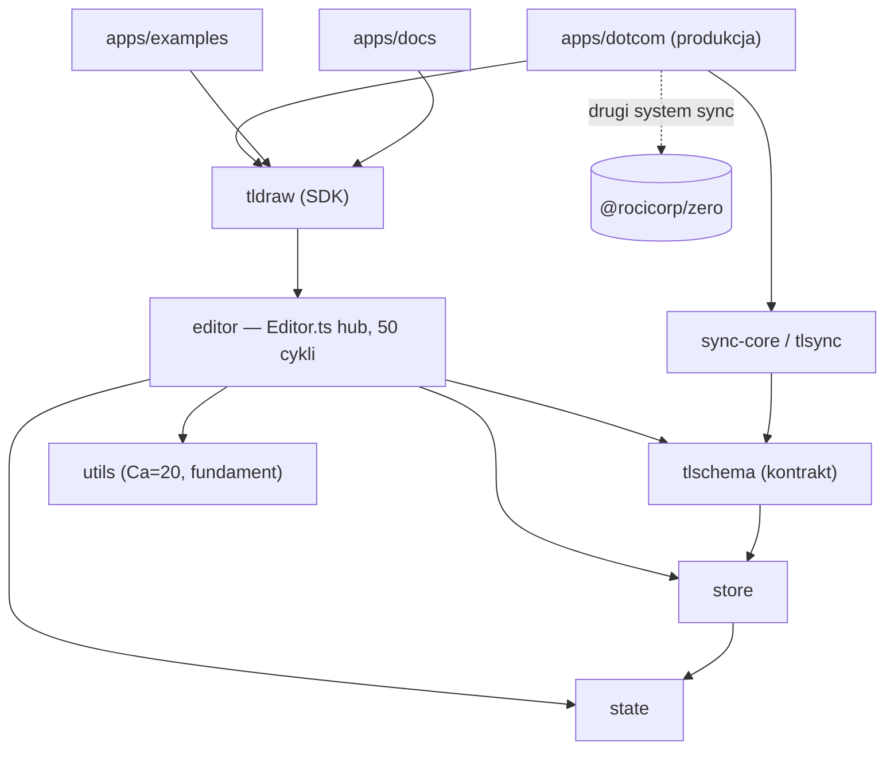

# Mapa projektu — tldraw

> Dokument onboardingowy. Synteza z `artifact-1-territory.md` (historia gita), `artifact-2-structure.md` (graf zależności) i `artifact-3-contributors.md` (kontekst ludzi). Okno analizy: ostatnie ~12 miesięcy (2025-07-30 → 2026-07-31). Cel: po 15 min wiesz, gdzie rzeczy żyją, co jest niebezpieczne i od czego zacząć.

## 1. TL;DR

tldraw to **whiteboard SDK w TypeScript** (monorepo yarn+lerna, 5 lat historii, 6134 commity na `main`). Kod układa się w czystą piramidę: **fundament** (`utils`, `state`, `store`, `tlschema`, `validate`) → **silnik** (`editor`) → **pakiet-produkt** (`tldraw`) → **synchronizacja** (`sync-core`/`tlsync` + `@rocicorp/zero`) → **aplikacje** (`apps/dotcom` = produkcja, `examples`/`docs` = demo). Praca skupia się w dwóch miejscach: **produkcyjnym `apps/dotcom`** (największy wolumen, wielki spike w Q4-2025) oraz **rdzeniu SDK** (`tldraw`+`editor`, stałe centra każdego kwartału). Boli w trzech miejscach: **wnętrze rdzenia** (`Editor.ts` to hub z 50 cyklami plikowymi, `tldraw` ma 49), **kontrakt danych** `tlschema` (zmiana rozlewa się przez wszystkie warstwy) i **dwa systemy sync** obok siebie (własny `tlsync` vs `@rocicorp/zero` w dotcom).

## 2. Teren — gdzie żyje praca

- **Rdzeń SDK (stałe centrum):** `packages/editor` + `packages/tldraw` — obecne w każdym kwartale, rosną do Q2-2026. Plik `Editor.ts` (87 zmian) to najgorętszy w repo. *Głębokie* moduły (realna logika).
- **Produkcja:** `apps/dotcom` — najwyższy wolumen (3069), ale nierówny: **spike Q4-2025 (1691) = duża kampania**, potem stabilnie wysoko. Tu żyją konta, sync, admin, assets.
- **Peryferia (płytkie, konsumenci):** `apps/examples`, `apps/docs` — dużo zmian, ale głównie *podążają za API SDK* (tańszy rodzaj aktywności).
- **Świeże / historyczne:** `packages/commenting` dopiero się rozgrzewa (Q3-2026). `packages/fairy-shared` był gorący (AI, spike Q4-2025), ale **został USUNIĘTY** — struktura katalogów z historii kłamie, to zamknięta kampania.
- **Szum (nie hotspoty):** `version.ts`, `releases/next.mdx`, `deploy-dotcom.ts` — mechaniczny auto-bump przy release.

## 3. Realne powiązania (skąd wiemy)

- **Rdzeń SDK spleciony:** `editor ↔ tldraw` — co-change 141 (git) *oraz* oba to huby cykli plikowych (madge: 50/49). Zmiana w sercu silnika rozlewa się lokalnie szeroko.
- **Kontrakt danych:** `tlschema` — Ca=6 w grafie importów *i* częste co-change z `editor`/`tldraw` (git). Zmiana schematu idzie `store → editor → tldraw → apps`.
- **Fundament nośny:** `utils` — Ca=20 (graf), instability 0.00. Największy blast radius, ale stabilny.
- **Produkcja orbituje wokół SDK:** `dotcom → tldraw/editor` (co-change 63/41) + `dotcom-shared` (56) + `internal/scripts` (deploy, 50).
- **Granice pakietów trzymają:** graf pokazał **0 cykli międzypakietowych** (DAG) — splątanie jest *wewnątrz* rdzenia, nie między warstwami.
- `unknown`: `@rocicorp/zero` w dotcom to **runtime coupling** (sync), którego graf importów statycznych nie oddaje w pełni.

## 4. Strefy ryzyka

| Strefa | Dlaczego ryzykowna |
|--------|--------------------|
| `packages/editor` / `Editor.ts` | Hub silnika, 50 cykli plikowych ↔ managery; zmiana ciągnie wiele modułów |
| `packages/tlschema` | Kontrakt danych — zmiana schematu przechodzi przez wszystkie warstwy |
| `packages/utils` | Ca=20 — największy zasięg zmiany w całym monorepo (choć stabilny) |
| Synchronizacja (dwa systemy) | `tlsync`/`sync-core` **vs** `@rocicorp/zero` w dotcom — nazwa „sync" myli między warstwami |
| `apps/dotcom/sync-worker` + `TLUserDurableObject.ts` | Real-time stan na Cloudflare Durable Objects |
| `packages/tldraw` (UI) | 49 cykli plikowych — UI/shapes/konteksty gęsto splecione |

## 5. Kogo zapytać (per strefa)

- Rdzeń SDK (`editor`/`tldraw`/`tlschema`) → **Steve Ruiz** (lead), potem Mime Čuvalo.
- Synchronizacja `tlsync`/`sync-core` → **David Sheldrick** (WebSocket, sqlite), potem Steve Ruiz.
- Produkcja `dotcom` + sync przez `@rocicorp/zero` → **Mitja Bezenšek**, potem David Sheldrick.
- `commenting` (nowy) → **Jessica Claire Edwards**.

*Uwaga: wiedza skupiona (niski bus factor) — rozmowa z właściwym specjalistą PRZED dużą zmianą.*

## 6. Pierwszy dzień — od czego zacząć (5–8 plików)

1. `packages/editor/src/lib/editor/Editor.ts` — serce silnika; zrozum hub i jego managery.
2. `packages/tldraw/src/index.ts` — publiczny kontrakt SDK (co eksportujemy).
3. `packages/tlschema/src` — model/schema danych (kontrakt między warstwami).
4. `packages/utils/src` — fundament, od którego zależy pół repo.
5. `packages/sync-core/src` — własny protokół sync (`tlsync`), sqlite/WebSocket.
6. `apps/dotcom/client/src/tla/app/TldrawApp.ts` — jak produkcja składa SDK.
7. `apps/dotcom/sync-worker/src/TLUserDurableObject.ts` — sync runtime (Durable Objects).
8. `CLAUDE.md` / `AGENTS.md` / `CONTEXT.md` — konwencje repo (tldraw sam praktykuje context-engineering z modułu 4).

## 7. Ograniczenia — czego ta mapa NIE mówi

- **Okno:** tylko ostatnie ~12 miesięcy historii gita. Aktywność ≠ ważność; spike może być kampanią lub serią napraw.
- **Metoda:** co-change (git) + graf zależności z `package.json` (prod+peer, poziom pakietów) + `madge` (cykle plikowe). **Nie** widzi: runtime coupling (`@rocicorp/zero`, DI, feature flags, config, codegen), treści 50/49 cykli (celowy wzorzec kontroler↔menedżer vs dług — `needs verification`), jakości kodu, formalnych własności.
- **Historia ≠ dziś:** `fairy-shared` gorący w danych, ale usunięty — zawsze weryfikuj istnienie przed oparciem decyzji.
- To **mapa terytorium (Wide Scan)**, nie Deep Focus. Naturalny następny krok (L3): wejść w jedną strefę ryzyka — najlepszy kandydat to `editor`/`Editor.ts` (hub + cykle) albo warstwa sync (dwa systemy).
